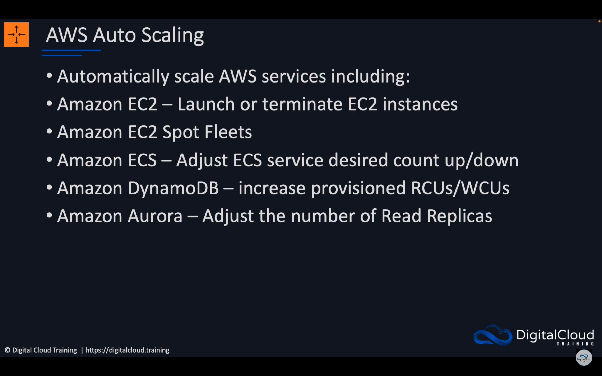

-   

<a href="https://www.youtube.com/watch?v=xQeGrgQJJDc&list=PLO95rE9ahzRs0QMA8qtIAstWFo4X4gHtH&index=5&t=158s">AWS Auto Scaling Deep Dive</a>

    

    

    

    

    

    

    

    

    

    

    

