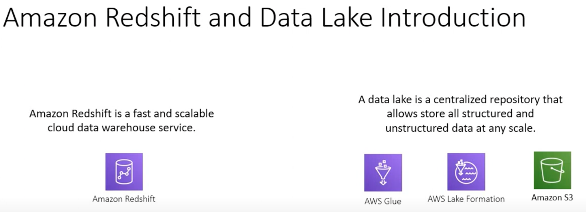

-   

<a href="https://www.youtube.com/watch?v=Co8UpEYlZYA&list=PLO95rE9ahzRuUGYApNciILstNNJlvuc6g&index=2&t=205s">AWS Tutorials - Using Amazon Redshift in AWS based Data Lake</a>

    

    

    

    

    

    

    

    

    

    

    

    

    

-   

<a href="https://www.youtube.com/watch?v=4dnp8pm5dLA&list=PLO95rE9ahzRuUGYApNciILstNNJlvuc6g&index=7&t=55s">AWS Tutorials - Using Amazon Redshift Data APIs for ETL</a>

    

    

    

    

    

    

    

    

    

    

    

    

    

    

    

    

    

    

    

    

    

    

    

    

    

    

    

    

    

    

    

    

    

    

    

    

    

    

    

    

