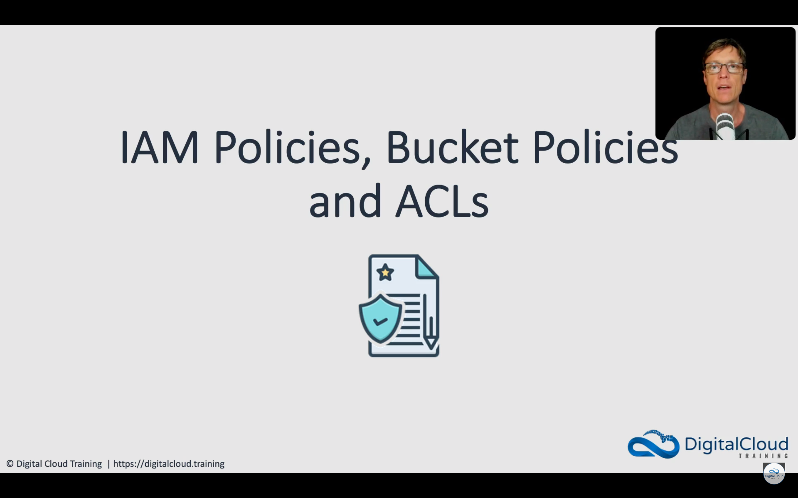

<div></div>
<div></div>
<div></div>
<div></div>
<div></div>
<div></div>
<div></div>
<div></div>
<div></div>
<div></div>
<div></div>
<div></div>

---

#### User Policies

-   **List buckets (user policy)**

    ```json
    {
        "Version": "2012-10-17",
        "Statement": [
            {
                "Sid": "AllowGroupToSeeBucketListInTheConsole",
                "Action": ["s3:ListAllMyBuckets"],
                "Effect": "Allow",
                "Resource": ["arn:aws:s3:::*"]
            }
        ]
    }
    ```

-   **See root-level bucket items (user policy)**

    ```json
    {
        "Version": "2012-10-17",
        "Statement": [
            {
                "Sid": "AllowGroupToSeeBucketListAndAlsoAllowGetBucketLocationRequiredForListBucket",
                "Action": ["s3:ListAllMyBuckets", "s3:GetBucketLocation"],
                "Effect": "Allow",
                "Resource": ["arn:aws:s3:::*"]
            },
            {
                "Sid": "AllowRootLevelListingOfCompanyBucket",
                "Action": ["s3:ListBucket"],
                "Effect": "Allow",
                "Resource": ["arn:aws:s3:::YOURBUCKETNAME"],
                "Condition": {
                    "StringEquals": {
                        "s3:prefix": [""],
                        "s3:delimiter": ["/"]
                    }
                }
            }
        ]
    }
    ```

-   **View the Department folder contents (user policy)**

    ```json
    {
        "Version": "2012-10-17",
        "Statement": [
            {
                "Sid": "AllowGroupToSeeBucketListAndAlsoAllowGetBucketLocationRequiredForListBucket",
                "Action": ["s3:ListAllMyBuckets", "s3:GetBucketLocation"],
                "Effect": "Allow",
                "Resource": ["arn:aws:s3:::*"]
            },
            {
                "Sid": "AllowRootLevelListingOfCompanyBucket",
                "Action": ["s3:ListBucket"],
                "Effect": "Allow",
                "Resource": ["arn:aws:s3:::YOURBUCKETNAME"],
                "Condition": {
                    "StringEquals": {
                        "s3:prefix": [""],
                        "s3:delimiter": ["/"]
                    }
                }
            },
            {
                "Sid": "AllowListBucketIfSpecificPrefixIsIncludedInRequest",
                "Action": ["s3:ListBucket"],
                "Effect": "Allow",
                "Resource": ["arn:aws:s3:::YOURBUCKETNAME"],
                "Condition": { "StringLike": { "s3:prefix": ["Department/*"] } }
            }
        ]
    }
    ```

-   **Get and put objects in the Department folder (user policy)**

    ```json
    {
        "Version": "2012-10-17",
        "Statement": [
            {
                "Sid": "AllowGroupToSeeBucketListAndAlsoAllowGetBucketLocationRequiredForListBucket",
                "Action": ["s3:ListAllMyBuckets", "s3:GetBucketLocation"],
                "Effect": "Allow",
                "Resource": ["arn:aws:s3:::*"]
            },
            {
                "Sid": "AllowRootLevelListingOfCompanyBucket",
                "Action": ["s3:ListBucket"],
                "Effect": "Allow",
                "Resource": ["arn:aws:s3:::YOURBUCKETNAME"],
                "Condition": {
                    "StringEquals": {
                        "s3:prefix": [""],
                        "s3:delimiter": ["/"]
                    }
                }
            },
            {
                "Sid": "AllowListBucketIfSpecificPrefixIsIncludedInRequest",
                "Action": ["S3:ListBucket"],
                "Effect": "Allow",
                "Resource": ["arn:aws:s3:::YOURBUCKETNAME"],
                "Condition": {
                    "StringLike": { "s3:prefix": ["Department/*"] }
                }
            },
            {
                "Sid": "AllowUserToReadWriteObjectDataInDepartmentFolder",
                "Action": ["s3:GetObject", "s3:PutObject"],
                "Effect": "Allow",
                "Resource": ["arn:aws:s3:::YOURBUCKETNAME/Department/*"]
            }
        ]
    }
    ```

-   **Explicitly grant access to Paul to list the Confidential folder (Bucket Policy) - use with policy 2 above**

    ```json
    {
        "Version": "2012-10-17",
        "Id": "Policy1561964929358",
        "Statement": [
            {
                "Sid": "Stmt1561964454052",
                "Effect": "Allow",
                "Principal": {
                    "AWS": "arn:aws:iam::138422235973:user/Paul"
                },
                "Action": "s3:*",
                "Resource": "arn:aws:s3:::YOURBUCKETNAME",
                "Condition": {
                    "StringLike": {
                        "s3:prefix": "Confidential/*"
                    }
                }
            }
        ]
    }
    ```

---
